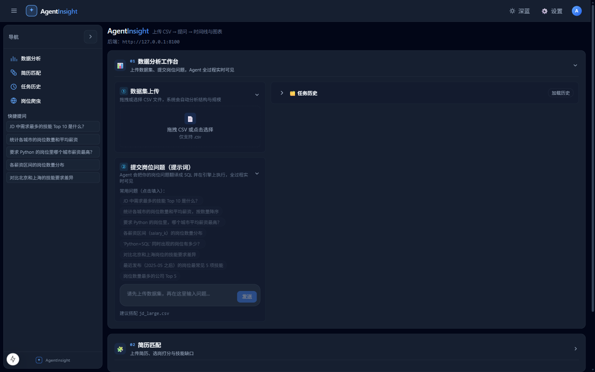
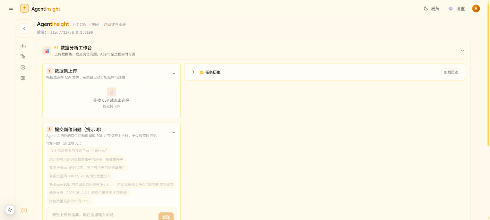
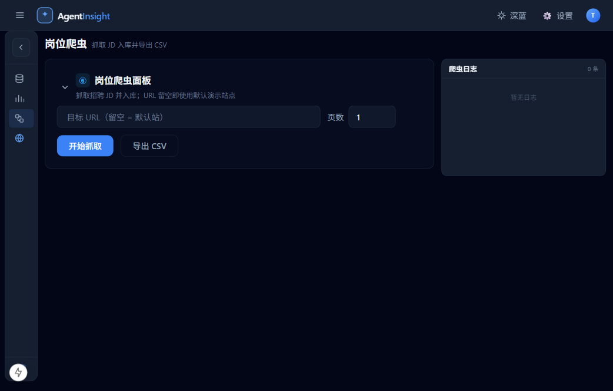

# AgentInsight — 会看数据的 AI Agent（Multi-Agent 数据分析 + 简历岗位匹配）

> **当前状态（2026-03-12）**：V3.0 发布——移除 Spark 依赖，专注 DuckDB 单机分析；新增 Context Engineering（Token 预算控制 + 上下文压缩）、Report Synthesizer（模板化汇总 + 可选 LLM 润色）、Few-shot 检索、动态复杂度规划。

上传一份 CSV，用中文提问，Agent 自动分析数据、生成 SQL、执行、校验并画图；上传简历 + 勾选岗位，resume∥job **并行**的多智能体工作流输出匹配评分与技能缺口。全过程通过 SSE 实时推送执行时间线（含 plan/并行/retry 事件）。所有数据走 DuckDB 内存查询，20 万行以内即席分析轻松应对。

## 界面预览

MiMo 风格 App Shell：可折叠侧栏（数据集 / 数据分析 / 简历匹配 / 岗位爬虫）+ 深蓝 / 浅色暖黄双主题。

| 深蓝紧凑布局 | 浅色暖黄 |
|---|---|
|  |  |

| 简历匹配（右侧日志） | 岗位爬虫（右侧日志） |
|---|---|
|  |  |

## V3.0 变更

| 变更 | 说明 |
|------|------|
| **移除 Spark** | 专注 DuckDB 单机分析，降低部署复杂度（无需 Docker/Spark 镜像） |
| **新增 Context Engineering** | Token 预算控制（4000/1000/8000）+ 上下文压缩（简历/JD/Schema/结果） |
| **新增 Report Synthesizer** | 模板化汇总报告 + 可选 LLM 润色（`report_llm_enabled` 开关） |
| **新增 Few-shot 检索** | 历史成功 SQL 作为 LLM 示例，TF-IDF 相似度检索 top-3 |
| **新增动态规划** | 按查询复杂度（SIMPLE/NORMAL/COMPLEX）自适应生成执行链路 |
| **新增复杂度评估** | 单聚合词→SIMPLE（跳过 validator）；对比/嵌套/多表→COMPLEX（增强校验） |
| **新增评测接口** | `GET /api/evaluations/last` 只读评测报告 |
| **界面全面优化** | MiMo App Shell、四视图、可折叠板块、双主题、右侧日志 |

**核心原则**：
- Multi-Agent 是核心能力
- Redis 是运行时增强（挂了自动降级）
- DuckDB 是唯一数据执行引擎
- 界面是用户体验载体

## 框架决策对照（为什么不用 LangGraph / DeepAgents）

| 维度 | 自研 Runtime（本项目） | LangGraph / DeepAgents |
|---|---|---|
| 场景 | 3~4 节点确定性 DAG（resume∥job→match；data→validator） | 开放式长循环研究任务、复杂状态机 |
| 可讲性 | 状态机/重试/消息协议每行代码可解释，面试可深挖 | "调框架"，原理层是黑盒 |
| Trace | 自研 MySQL task_steps + SSE 时间线（已差异化落地） | 依赖框架 checkpoint/LangSmith，体系旁路 |
| 依赖 | 仅 fastapi/openai/duckdb 等轻依赖 | langgraph 全家桶（~百 MB，版本迭代快） |
| 结论 | **保持自研**；未来做"岗位市场深度调研"类开放式任务时，以适配器试点接入（+1 天） | 预埋面试问答："为什么不用 LangGraph" |

## 架构图

```
                    ┌──────────────────────────────────────────────────┐
                    │                    浏览器（:3100）                 │
                    │   Next.js 15 单页：上传 / 提问 / 时间线 / 图表      │
                    └───────▲──────────────────────────▲───────────────┘
                            │ REST (POST /api/...)     │ SSE (EventSource)
                    ┌───────┴──────────────────────────┴───────────────┐
                    │                FastAPI 后端（:8100）               │
                    │  ┌────────────┐  ┌────────────────────────────┐  │
                    │  │  API 层     │  │  Agent Runtime             │  │
                    │  │ datasets   │──▶ Supervisor.route/run_task   │  │
                    │  │ tasks(SSE) │  │  TaskState 状态机 + Registry │  │
                    │  │ resumes    │  │  Planner (动态复杂度)         │  │
                    │  │ matches    │  └──────┬──────────┬──────────┘  │
                    │  │ settings   │         │          │             │
                    │  │ models     │  ┌──────▼─────┐ ┌──▼──────────┐  │
                    │  │ health     │  │ data_agent │ │validator_   │  │
                    │  └─────┬──────┘  │ NL2SQL+Few-shot│agent 结果校验│ │
                    │        │         │ SQL Guard  │ └─────────────┘  │
                    │        │         │ DuckDB     │                   │
                    │        │         └──┬─────────┘                   │
                    │        │  ┌─────────▼──────────┐                 │
                    │        │  │ Report Synthesizer │                 │
                    │        │  │ (模板汇总+LLM润色)  │                 │
                    │        │  └────────────────────┘                 │
                    │  ┌─────▼──────────────────────────────────┐      │
                    │  │ Context Engineering                    │      │
                    │  │ TokenBudget + Compressor + Builder     │      │
                    │  └────────────────────────────────────────┘      │
                    │  ┌──────────────────────────────────────────┐    │
                    │  │   MySQL 8.0（数据集/任务/步骤/JD 落库）    │    │
                    │  └──────────────────────────────────────────┘    │
                    │   Redis（Docker，SSE 缓存，可选，挂了自动降级）     │
                    └──────────────────────────────────────────────────┘
```

## 环境要求

以下为本机已实测环境，其余相近版本一般也可：

| 组件 | 版本 | 说明 |
|---|---|---|
| OS | Windows 11 | |
| Python | 3.12.8（全局安装，无 venv） | 依赖装进全局 |
| MySQL | 8.0.26（本机 Windows 服务 MySQL80，端口 3306） | 存数据集/任务/步骤/爬虫 JD |
| Node.js | 24 | 跑 Next.js 前端 |
| Docker Desktop | 29.2.1 | 可选：起 Redis；不装 Docker 也能跑 |
| Redis 镜像 | redis:7-alpine | 可选 |

> **V3.0 无需 Spark**：已移除 Spark 依赖与相关配置（`SPARK_ROW_THRESHOLD`/`SPARK_IMAGE` 等）。

Python 依赖见 `backend/requirements.txt`；前端依赖见 `frontend/package.json`。

## 五步启动

```bash
# ① 生成 demo 数据：1 万行销售明细
python scripts/gen_data.py

# ② 复制 .env.example 为 .env，填好 MySQL 密码后初始化库表与账号
python scripts/init_db.py

# ③ 起 Redis（可选；不起也能跑，系统自动降级）
docker compose up -d

# ④ 起后端（在 backend 目录下）
cd backend
python -m uvicorn app.main:app --port 8100

# ⑤ 起前端（新开终端，在 frontend 目录下）
cd frontend
npm install
npm run dev
```

浏览器打开 http://localhost:3100 即可使用。

LLM 配置说明：在 `.env` 里填 `LLM_API_KEY`（DeepSeek / GLM 等 OpenAI 兼容接口均可）；没有 key 时把 `LLM_PROVIDER=mock`（或留空 key），内置规则版 NL2SQL 也能跑通全链路。也可在前端 `/settings` 页面添加模型配置，支持多模型热切换。

## 两条 Demo

### 链路 A：数据分析（DuckDB）

1. 首页上传 `data/demo/demo_sales.csv`（1 万行销售明细）。
2. 在提问框输入：**按地区统计总销售额**（或点示例按钮）。
3. 观察 Agent 时间线：`data_agent` → 复杂度评估（NORMAL）→ Few-shot 检索 → 生成 SQL → SQL Guard → DuckDB 执行 → `validator_agent` 校验 → `report_synthesizer` → 结果卡片显示 SQL、柱状图与结果表。

### 链路 B：简历匹配（Multi-Agent 并行）

1. 上传简历（PDF/DOCX/TXT）。
2. 从岗位列表勾选 1~N 个岗位。
3. 点击"开始匹配"，观察时间线：`resume ∥ job` 并行执行 → `match_agent` 五维打分 → `validator_agent` 校验 → `report_synthesizer` 报告 → 结果展示分数环/分项条/技能缺口标签。

## Benchmark

> **V3.0 待实测**。以下为 V2.x 参考基线（移除 Spark 后 DuckDB 链路应保持同等或更优性能）。

| 场景 | 数据规模 | 引擎 | 端到端耗时 | 备注 |
|---|---|---|---|---|
| 按地区统计总销售额（全链路） | 1 万行 CSV | DuckDB | 待实测 | 含 NL2SQL+执行+校验+报告 |
| 技能 Top 10 | 20 万行 CSV | DuckDB | 待实测 | memory_limit 1GB |
| 匹配链路（resume∥job 并行） | - | - | 待实测 | 含 LLM 结构化+打分+报告 |
| SSE 首事件延迟 | - | - | 待实测 | 用户"立刻看到 Agent 动起来" |

### 接口响应延迟（V2.x 基线，`python scripts/api_bench.py --n 10`）

| 层 | 用例 | n | 中位 | P95 |
|---|---|---|---|---|
| L1 可用性 | GET /api/health | 10 | 14.1ms | 23.7ms |
| L1 可用性 | GET /api/health/mysql | 10 | 52.3ms | 78.5ms |
| L2 读接口 | GET /api/settings | 10 | 46.9ms | 80.3ms |
| L3 写与链路 | POST /api/datasets（1 万行 CSV） | 5 | 118.1ms | 142.7ms |
| L3 写与链路 | 数据链路 SSE 首事件 | 5 | **25.0ms** | 31.9ms |
| L3 写与链路 | 数据链路 SSE final（端到端） | 5 | **296.3ms** | 428.4ms |
| L3 写与链路 | 匹配链路 SSE final（端到端） | 5 | **358.2ms** | 409.1ms |

### 评测 100 case（`python -m app.evaluation.runner`）

| 指标 | mock 基线 | GLM-4.5-air |
|---|---|---|
| NL2SQL 执行成功率（60 case） | 96.67% | 95.00% |
| NL2SQL 结构通过率 | 61.67% | 63.33% |
| 匹配分数/缺口准确率（20 case） | 100% / 100% | 100% / 100% |
| 路由准确率（10 case） | 100% | 100% |
| 异常 graceful 率（10 case） | 100% | 90% |

## 链路C Redis 缓存（同一简历 + 同 2 个 JD 连跑两次）

| 运行 | 端到端 | cache 事件 | LLM/解析调用 |
|---|---|---|---|
| 第 1 次 | 21.3s | resume MISS + job MISS | 全量 |
| 第 2 次 | 8.8s（**2.4x 提速**） | resume **HIT** + job **HIT** | 0 次解析/结构化 |
| 运行中重复提交 | **409** + 原 task_id | - | - |

## auth（登录/注册/数据隔离）

- 打开 `http://localhost:3100` 未登录自动跳 `/login`（注册/登录双模式，token 存 localStorage）
- 全局 fetch 自动注入 `Authorization: Bearer`，401 自动跳回登录页
- 无 token 访问受保护接口 → 401；A 用户资源，B 用户访问 → 404（不泄露存在性）
- `POST /api/auth/register` → `POST /api/auth/login` 得 7 天 JWT
- 存量数据（user_id=NULL）为公共遗留，登录用户均可见

## .env 变量说明

| 变量 | 说明 | 缺省行为 |
|---|---|---|
| `LLM_PROVIDER` | `openai` / `mock` | 无 key 或 `mock` 时自动降级内置规则版 NL2SQL |
| `LLM_BASE_URL` | OpenAI 兼容接口地址，如 `https://api.deepseek.com/v1` | 空 |
| `LLM_API_KEY` | 对应服务商的 key | 空则降级 mock |
| `LLM_MODEL` | 模型名，如 `deepseek-chat` / `glm-4-flash` | 空 |
| `MYSQL_HOST` / `MYSQL_PORT` | MySQL 地址 | 127.0.0.1 / 3306 |
| `MYSQL_ROOT_PASSWORD` | 仅 `scripts/init_db.py` 初始化时使用 | 空 |
| `MYSQL_USER` / `MYSQL_PASSWORD` | 应用账号（init_db 会创建并授权） | agent_app / 空 |
| `MYSQL_DATABASE` | 库名 | agentinsight |
| `REDIS_URL` | Redis 连接串 | redis://127.0.0.1:6379/0 |
| `MAX_AGENT_STEPS` | 单任务最大步数上限 | 8 |
| `MAX_RETRY` | agent 单步失败重试次数 | 2 |
| `SQL_MAX_ROWS` | 结果行数上限；guard 自动补/改写 LIMIT | 1000 |
| `DATA_DIR` / `UPLOAD_DIR` | 数据与上传目录 | `<repo>/data` 与 `<repo>/data/uploads` |
| `APP_SECRET` | JWT 签名密钥；缺失时自动生成写回 .env | 自动生成 |

> **V3.0 已移除**：`SPARK_ROW_THRESHOLD` / `SPARK_IMAGE` 等 Spark 相关变量。

## 常见问题

**8GB 内存可行吗？**
完全可行。V3.0 移除 Spark 后内存占用大幅降低。MySQL、后端、前端都是轻量常驻；DuckDB 查询是流式内存计算，10 万行级 CSV 占用很小。这是 V3.0 的核心优化之一——不再需要为 Spark 容器预留 3-4GB。

**为什么 V3.0 移除 Spark？**
三个原因：① 部署复杂度——Spark 需要 Docker + 镜像拉取 + JVM 启动，对 8GB 机器不友好；② 维护成本——双引擎路由增加代码复杂度，DuckDB 在 20 万行内表现已足够；③ 聚焦核心价值——项目核心是 Multi-Agent Runtime 和 Context Engineering，不是大数据处理引擎。

**为什么不用 LangChain？**
本项目核心是展示 Agent 的运行时机制：状态机、消息流、SSE 事件、重试与校验。自己写 Supervisor + Registry 只有几百行，每一步都可控、可测、可解释；套 LangChain 反而把编排黑盒化，调试和教学成本都更高。

**Redis 挂了会怎样？**
不影响主链路。Redis 只做辅助缓存，后端对 Redis 的所有调用都有降级处理：连不上时记 warning、`GET /api/health/redis` 返回 `{"redis":"degraded"}` 而非 500，任务照常执行。SSE 事件本体走进程内 TaskBus，不依赖 Redis。想彻底省资源可以不启动 Redis 容器。

**如何启用 LLM 润色报告？**
在设置中心 PUT `{"key": "report_llm_enabled", "value": "true"}`，或在 `/settings` 页面开启。默认使用模板化汇总（纯文本拼接，无 LLM 调用）。

## 更多文档

- API 接口参考：见 [docs/API.md](docs/API.md)
- 系统设计与扩展指南：见 [ARCHITECTURE.md](ARCHITECTURE.md)
- V3.0 完整开发设计文档：见 [docs/AgentInsight_V3.0_开发设计文档.md](docs/AgentInsight_V3.0_开发设计文档.md)
- 前端实现讲解：见 [frontend/README.md](frontend/README.md)

## 企业级工程化（E1 硬化批次）

| 维度 | 落地内容 |
|---|---|
| 可观测性 | **结构化 JSON 日志**（每行含 `request_id`/`task_id`，`X-Request-ID` 请求头透传）；K8s 风格探针 **`/healthz`**（存活）/**`/readyz`**（就绪：MySQL 必须 up，Redis 允许降级）；**`/metrics`**（请求总数/错误数/平均延迟） |
| 安全 | 登录/注册限流 **5 次/分钟/IP+用户名**（429 + 等待秒数）；任务创建限流 **30 次/分钟/用户**；query 长度上限 2000（422）；依赖全量**精确锁版**（requirements.txt）；密钥 Fernet 加密落库 |
| 可靠性 | **版本化数据库迁移**（`app/persistence/migrations.py`，启动自动应用、幂等重放、`schema_migrations` 版本表）；**基线索引 v1**；任务历史**分页**（page/has_more）；幂等锁防重复提交 |
| 质量 | 77+ 单测全绿（全离线）；连接池化；TaskBus 事件上限 500 + TTL 清扫 |

> 多实例演进路径：限流换 Redis ZSET、指标换 Prometheus client、日志接 ELK——接口已按此预留。
